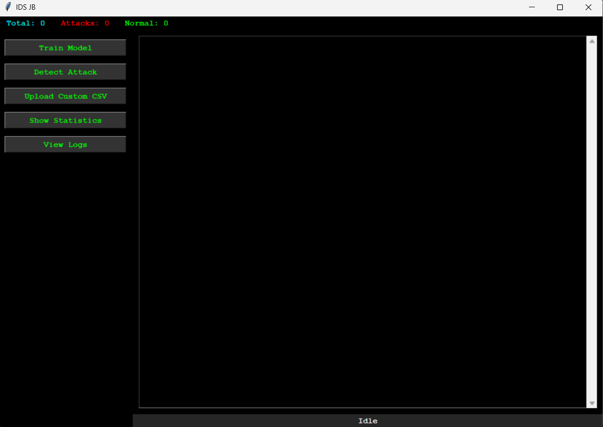
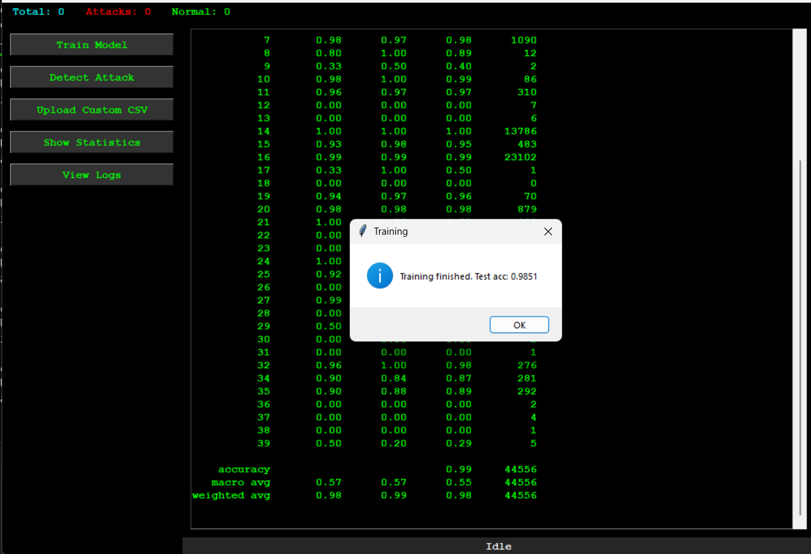
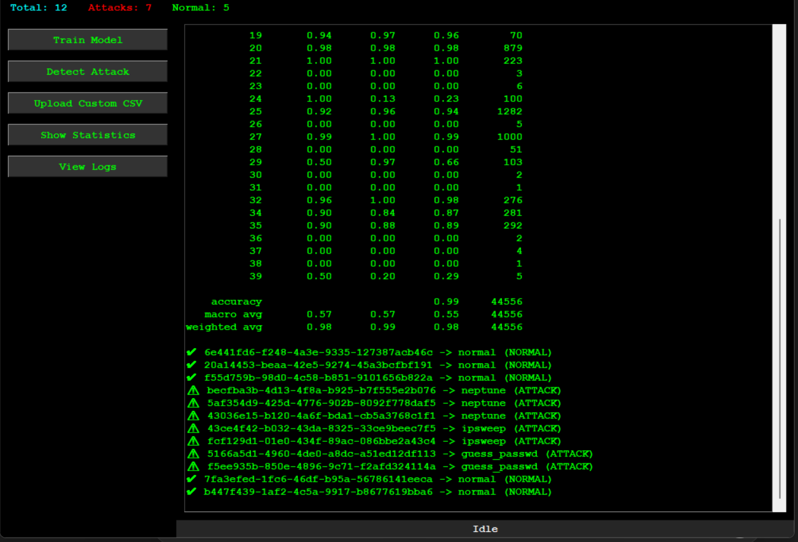
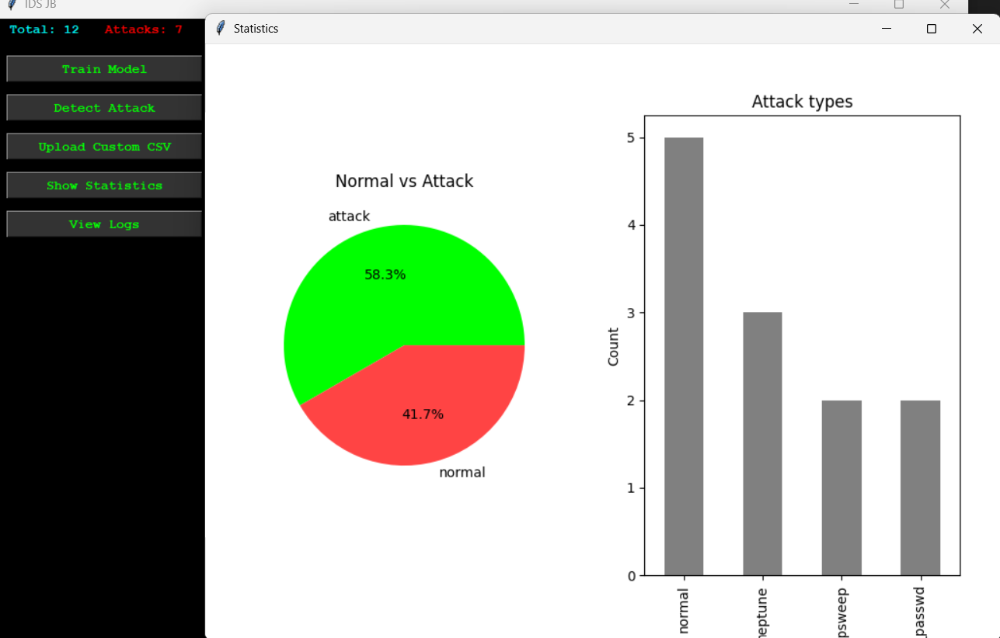
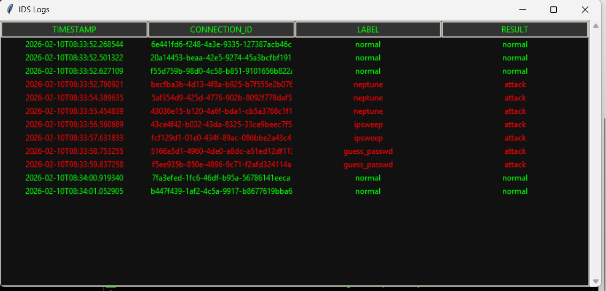

# ML Based Intrusion Detection System (IDS)

Cybersecurity + Machine Learning portfolio project demonstrating how neural networks can be used to detect malicious network activity.

This project implements an anomaly-based Intrusion Detection System using a Neural Network (MLP) trained on the NSL-KDD dataset, with a graphical monitoring dashboard that simulates real-world security alerting.

🎯 **Target Roles:** Security Analyst • SOC Analyst • Security Engineer (Junior) • Internships

---

## 🧠 Why This Project Matters

This project demonstrates:

- Applying machine learning to real cybersecurity datasets  
- Understanding of network attack categories and threat behavior  
- Building an end-to-end detection pipeline, not just a model  
- Presenting results through a security-style dashboard  

---

## 🚨 What the System Does

- Trains a Neural Network classifier to distinguish between normal and malicious traffic  
- Detects and classifies common network attacks  
- Displays alerts, logs, and traffic statistics in a GUI  
- Allows testing with custom traffic CSV files  

---

## 🧠 Attack Categories Detected

- **DoS (Denial of Service)** – smurf, neptune, back  
- **Probe / Reconnaissance** – portsweep, ipsweep  
- **R2L (Remote to Local)** – credential-based attacks  
- **U2R (User to Root)** – privilege escalation attacks  

---

## ⭐ Key Features

- Security monitoring dashboard (GUI)  
- Visual alerts for detected intrusions  
- Event logging with attack highlighting  
- Traffic statistics (normal vs malicious)  
- Custom dataset support for experimentation  

---

## 🛠 Technical Stack

- Python  
- Machine Learning (MLP / Neural Networks)  
- NSL-KDD cybersecurity dataset  
- Data preprocessing & feature engineering  
- Python-based GUI  

---

## ▶ How to Run

```bash
git clone https://github.com/j4nak445/intrusion-detection-system-.git
cd intrusion-detection-system-
python -m venv venv
source venv/bin/activate   # Windows: venv\Scripts\activate
pip install -r requirements.txt
python src/main.py

```

## 🔍 System Workflow

- Load and preprocess network traffic data  
- Encode categorical features and normalize values  
- Train a neural network classifier  
- Predict intrusion vs normal traffic  
- Display alerts and logs in the dashboard  

---

## 📈 Security & ML Concepts Demonstrated

- Intrusion Detection Systems (IDS)  
- Anomaly-based detection  
- Network attack classification  
- Feature encoding & normalization  
- Neural network model training  
- Security monitoring & alert visualization  

---

## ⚠️ Scope & Limitations

- Uses a benchmark dataset (NSL-KDD) rather than live packet capture  
- Intended for learning and portfolio demonstration, not production deployment  

---

## 📸 Screenshots

### Main GUI



### Training Process



### Attack Detection



### Statistics



### Logs




### Author:
- Janak
- Aspiring Cybersecurity Engineer
